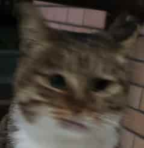

## 智能车电机开发 


> 完成情况
> - [ ] 完成 GPIO 初始化
> - [ ] 调试 UART 串口
> - [ ] 编写说明文档



---
### 目录
- [智能车电机开发](#智能车电机开发)
  - [目录](#目录)
  - [电机驱动](#电机驱动)
    - [第一层：电机基础驱动](#第一层电机基础驱动)
  - [PID控制算法](#pid控制算法)
---
### 电机驱动
---
#### 第一层：电机基础驱动
---
```c
/*电机引脚映射*/
//***************************
// 直流电机A
//		Pin assign
//			STM32			 驱动板
//		GPIOB_Pin_14 		---> AIN1
//		GPIOB_Pin_15		---> AIN2
//		GPIOB_Pin_3		    ---> PWMA(Timer2_CH2)
//**************************
#define MOTORA_Port GPIOB // 电机A引脚端口
#define AIN1_Pin GPIO_PIN_14
#define AIN2_Pin GPIO_PIN_15
#define PWMA_Pin GPIO_PIN_3
```

### PID控制算法
---
> comment
> notice,highlight,new thing
